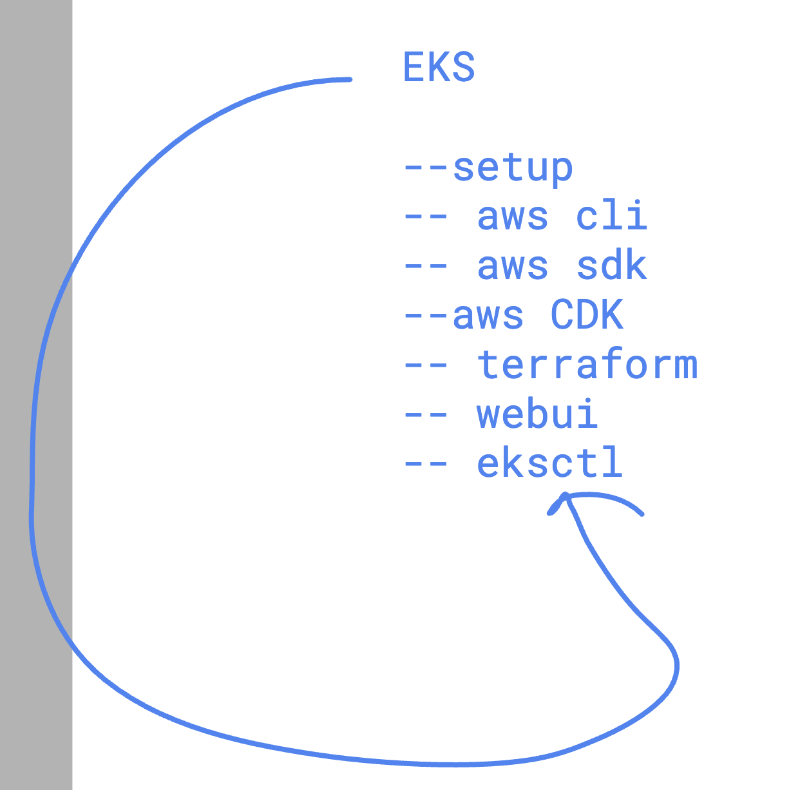

## Understanding container runtime engine and os / arch 


### checking docker client and server details

```
[ashu@roche-client ~]$ docker  version  
Client:
 Version:           25.0.3
 API version:       1.44
 Go version:        go1.20.12
 Git commit:        4debf41
 Built:             Mon Feb 12 00:00:00 2024
 OS/Arch:           linux/amd64
 Context:           default

Server:
 Engine:
  Version:          25.0.3
  API version:      1.44 (minimum version 1.24)
  Go version:       go1.20.12
  Git commit:       f417435
  Built:            Mon Feb 12 00:00:00 2024
  OS/Arch:          linux/amd64
  Experimental:     false
 containerd:
  Version:          1.7.11
  GitCommit:        64b8a811b07ba6288238eefc14d898ee0b5b99ba
 runc:
  Version:          1.1.11
  GitCommit:        4bccb38cc9cf198d52bebf2b3a90cd14e7af8c06
 docker-init:
  Version:          0.19.0
  GitCommit:        de40ad0

```

### creating a directory strucuter

```
[ashu@roche-client ~]$ mkdir  -p ashu-project/{javaapp,pythonapp,webapp}
[ashu@roche-client ~]$ ls
ashu-project
[ashu@roche-client ~]$ ls  ashu-project/
javaapp  pythonapp  webapp
[ashu@roche-client ~]$ 


```


### docker platform mishmatch error 

```
docker run -itd --name x1  13d89941a404
WARNING: The requested image's platform (linux/arm64/v8) does not match the detected host platform (linux/amd64/v3) and no specific platform was requested
f796f7837e1b4db1e31a0d2a9afc8d4a6db2301755ee478e3a214dcb964349ab
[ashu@roche-client ashu-project]$ 
```

## app containerization


### taking sample code 

```
git clone https://github.com/schoolofdevops/html-sample-app.git

```

### understanding hosting platform 


### building iamge 

```
[ashu@roche-client ashu-project]$ ls
html-sample-app  javaapp  pythonapp  webapp
[ashu@roche-client ashu-project]$ docker  build  -t   ashunginx:appv1    html-sample-app/ 
[+] Building 0.2s (7/7) FINISHED                                                                                  docker:default
 => [internal] load build definition from Dockerfile                                                                        0.0s
 => => transferring dockerfile: 534B                                                                                        0.0s
 => [internal] load metadata for docker.io/library/nginx:latest                                                             0.0s
 => [internal] load .dockerignore                                                                                           0.0s
 => => transferring context: 134B                                                                                           0.0s
 => [internal] load build context                                                                                           0.1s
 => => transferring context: 2.05MB                                                                                         0.0s
 => [1/2] FROM docker.io/library/nginx:latest                                                                               0.0s
 => CACHED [2/2] COPY  .  /usr/share/nginx/html/                                                                            0.0s
 => exporting to image                                                                                                      0.0s
 => => exporting layers                                                                                                     0.0s
 => => writing image sha256:a03355c44409b5a02412c5038a67b867d764707995dd38552236177f70ad29f5                                0.0s
 => => naming to docker.io/library/ashunginx:appv1                                                                          0.0s
[ashu@roche-client ashu-project]$ 
```

### pushing images


```
[ashu@roche-client ashu-project]$ docker  images |  grep ashu
ashunginx            appv1             a03355c44409   6 minutes ago       190MB
dockerashu/roche     17july            13d89941a404   About an hour ago   619MB
[ashu@roche-client ashu-project]$ 
[ashu@roche-client ashu-project]$ 
[ashu@roche-client ashu-project]$ docker  tag    ashunginx:appv1   docker.io/dockerashu/ashuroche:nginxappv1  
[ashu@roche-client ashu-project]$ 
[ashu@roche-client ashu-project]$ docker login 
Log in with your Docker ID or email address to push and pull images from Docker Hub. If you don't have a Docker ID, head over to https://hub.docker.com/ to create one.
You can log in with your password or a Personal Access Token (PAT). Using a limited-scope PAT grants better security and is required for organizations using SSO. Learn more at https://docs.docker.com/go/access-tokens/

Username: dockerashu
Password: 
WARNING! Your password will be stored unencrypted in /home/ashu/.docker/config.json.
Configure a credential helper to remove this warning. See
https://docs.docker.com/engine/reference/commandline/login/#credentials-store

Login Succeeded
[ashu@roche-client ashu-project]$ docker  push docker.io/dockerashu/ashuroche:nginxappv1


```

### intro to k8s 


### architecture 1 


### setup of k8s 


### eks setup options




### checking kubectl version 

```
ubectl  version --client 
Client Version: v1.30.0
Kustomize Version: v5.0.4-0.20230601165947-6ce0bf390ce3
 humanfirmware@darwin  ~/roche-eks-july172024   master ±  

 ```

### downloading eks cred

```
[ashu@roche-client ashu-project]$ aws configure
AWS Access Key ID [None]: AK
AWS Secret Access Key [None]: 4daW+h
Default region name [None]: us-east-1
Default output format [None]: 


[ashu@roche-client ashu-project]$ eksctl  get cluster
NAME                    REGION          EKSCTL CREATED
delvex-cluster-new      us-east-1       True


[ashu@roche-client ashu-project]$ 
[ashu@roche-client ashu-project]$ eksctl  utils  write-kubeconfig   --cluster delvex-cluster-new  
2024-07-17 09:37:48 [✔]  saved kubeconfig as "/home/ashu/.kube/config"
[ashu@roche-client ashu-project]$ 
[ashu@roche-client ashu-project]$ 
[ashu@roche-client ashu-project]$ 
```

### get nodes details

```
[ashu@roche-client ashu-project]$ kubectl   get   nodes
NAME                             STATUS   ROLES    AGE     VERSION
ip-192-168-3-115.ec2.internal    Ready    <none>   3h46m   v1.29.3-eks-ae9a62a
ip-192-168-40-107.ec2.internal   Ready    <none>   3h46m   v1.29.3-eks-ae9a62a
ip-192-168-77-87.ec2.internal    Ready    <none>   27h     v1.29.3-eks-ae9a62a
ip-192-168-84-174.ec2.internal   Ready    <none>   3h46m   v1.29.3-eks-ae9a62a
ip-192-168-98-89.ec2.internal    Ready    <none>   3h45m   v1.29.3-eks-ae9a62a
[ashu@roche-client ashu-project]$ kubectl   get   nodes  -o wide 
NAME                             STATUS   ROLES    AGE     VERSION               INTERNAL-IP      EXTERNAL-IP     OS-IMAGE         KERNEL-VERSION                  CONTAINER-RUNTIME
ip-192-168-3-115.ec2.internal    Ready    <none>   3h46m   v1.29.3-eks-ae9a62a   192.168.3.115    35.173.180.97   Amazon Linux 2   5.10.219-208.866.amzn2.x86_64   containerd://1.7.11
ip-192-168-40-107.ec2.internal   Ready    <none>   3h46m   v1.29.3-eks-ae9a62a   192.168.40.107   18.207.181.79   Amazon Linux 2   5.10.219-208.866.amzn2.x86_64   containerd://1.7.11
ip-192-168-77-87.ec2.internal    Ready    <none>   27h     v1.29.3-eks-ae9a62a   192.168.77.87    54.89.188.20    Amazon Linux 2   5.10.219-208.866.amzn2.x86_64   containerd://1.7.11
ip-192-168-84-174.ec2.internal   Ready    <none>   3h46m   v1.29.3-eks-ae9a62a   192.168.84.174   44.204.162.89   Amazon Linux 2   5.10.219-208.866.amzn2.x86_64   containerd://1.7.11
ip-192-168-98-89.ec2.internal    Ready    <none>   3h46m   v1.29.3-eks-ae9a62a   192.168.98.89    23.22.191.103   Amazon Linux 2   5.10.219-208.866.amzn2.x86_64   containerd://1.7.11
[ashu@roche-client ashu-project]$ 

```

### understanding pod 


### pod manifest 

```
apiVersion: v1  # targeting api Version v1  
kind: Pod   # resource is POD 
metadata:
  name: ashupod1  # name of resource 
spec:
  containers:
  - image: docker.io/dockerashu/ashuroche:nginxappv1
    name: ashuc1 

```

### creating pod 

```
cd  k8s-resources/
[ashu@roche-client k8s-resources]$ ls
ashupod1.yaml
[ashu@roche-client k8s-resources]$ kubectl   create  -f  ashupod1.yaml  
pod/ashupod1 created
[ashu@roche-client k8s-resources]$ kubectl    get  pods
NAME         READY   STATUS    RESTARTS   AGE
amitpod1     1/1     Running   0          14s
ashupod1     1/1     Running   0          13s
dppod1       1/1     Running   0          6s
kudduspod1   1/1     Running   0          38s
mg-nginx     1/1     Running   0          2m12s
[ashu@roche-client k8s-resources]$ 
```

### more commands 

```
[ashu@roche-client k8s-resources]$ kubectl    get   no
NAME                             STATUS   ROLES    AGE     VERSION
ip-192-168-3-115.ec2.internal    Ready    <none>   4h29m   v1.29.3-eks-ae9a62a
ip-192-168-40-107.ec2.internal   Ready    <none>   4h29m   v1.29.3-eks-ae9a62a
ip-192-168-77-87.ec2.internal    Ready    <none>   28h     v1.29.3-eks-ae9a62a
ip-192-168-84-174.ec2.internal   Ready    <none>   4h29m   v1.29.3-eks-ae9a62a
ip-192-168-98-89.ec2.internal    Ready    <none>   4h29m   v1.29.3-eks-ae9a62a
[ashu@roche-client k8s-resources]$ kubectl    get   po  -o wide
NAME            READY   STATUS             RESTARTS   AGE     IP                NODE                             NOMINATED NODE   READINESS GATES
amitpod1        1/1     Running            0          4m54s   192.168.46.143    ip-192-168-40-107.ec2.internal   <none>           <none>
amitvpod1       1/1     Running            0          4m12s   192.168.45.210    ip-192-168-40-107.ec2.internal   <none>           <none>
anipod-1        1/1     Running            0          4m8s    192.168.117.113   ip-192-168-98-89.ec2.internal    <none>           <none>
ashupod1        1/1     Running            0          4m53s   192.168.112.201   ip-192-168-98-89.ec2.internal    <none>           <none>
dppod1          1/1     Running            0          4m46s   192.168.20.28     ip-192-168-3-115.ec2.internal    <none>           <none>
gauripod1       1/1     Running            0          4m36s   192.168.123.90    ip-192-168-98-89.ec2.internal    <none>           <none>
kdpod           1/1     Running            0          4m38s   192.168.116.154   ip-192-168-98-89.ec2.internal    <none>           <none>
kudduspod1      1/1     Running            0          5m18s   192.168.70.89     ip-192-168-84-174.ec2.internal   <none>           <none>
```


### describe 

```
kubectl  describe pod  ashupod1
Name:             ashupod1
Namespace:        default
Priority:         0
Service Account:  default
Node:             ip-192-168-98-89.ec2.internal/192.168.98.89
Start Time:       Wed, 17 Jul 2024 10:23:45 +0000
Labels:           <none>
Annotations:      <none>
Status:           Running
IP:               192.168.112.201
IPs:
  IP:  192.168.112.201
Containers:
  ashuc1:
    Container ID:   containerd://b97bad4709f8d66f343466d39c2c6dec4940cd81c06a7733d4e1678ba3c52f3c
    Image:          docker.io/dockerashu/ashuroche:nginxappv1
    Image ID:       docker.io/dockerashu/ashuroche@sha256:b59b697d11e7e4bebb3939cc7f08eda28b80d91803f9039e33605bee0a4f94bb
    Port:           <none>
    Host Port:      <none>
    State:          Running
      Started:      Wed, 17 Jul 2024 10:23:49 +0000
```

### checking logs 
```
kubectl  logs   ashupod1
/docker-entrypoint.sh: /docker-entrypoint.d/ is not empty, will attempt to perform configuration
/docker-entrypoint.sh: Looking for shell scripts in /docker-entrypoint.d/
/docker-entrypoint.sh: Launching /docker-entrypoint.d/10-listen-on-ipv6-by-default.sh
10-listen-on-ipv6-by-default.sh: info: Getting the checksum of /etc/nginx/conf.d/default.conf
10-listen-on-ipv6-by-default.sh: info: Enabled listen on IPv6 in /etc/nginx/conf.d/default.conf
/docker-entrypoint.sh: Sourcing /docker-entrypoint.d/15-local-resolvers.envsh
/docker-entrypoint.sh: Launching /docker-entrypoint.d/20-envsubst-on-templates.sh
/docker-entrypoint.sh: Launching /docker-entrypoint.d/30-tune-worker-processes.sh
/docker-entrypoint.sh: Configuration complete; ready for start up
2024/07/17 10:23:49 [notice] 1#1: using the "epoll" event method
2024/07/17 10:23:49 [notice] 1#1: nginx/1.27.0
2024/07/17 10:23:49 [notice] 1#1: built by gcc 12.2.0 (Debian 12.2.0-14) 
```

### going into container within the pod 

```
[ashu@roche-client k8s-resources]$ kubectl  exec -it   ashupod1 -- bash  
root@ashupod1:/# 
root@ashupod1:/# 
root@ashupod1:/# 
root@ashupod1:/# cd /usr/share/nginx/html/
root@ashupod1:/usr/share/nginx/html# ls
50x.html  assets  elements.html  generic.html  html5up-phantom.zip  images  index.html
root@ashupod1:/usr/share/nginx/html# 
root@ashupod1:/usr/share/nginx/html# ls
50x.html  assets  elements.html  generic.html  html5up-phantom.zip  images  index.html
root@ashupod1:/usr/share/nginx/html# exit
exit
[ashu@roche-client k8s-resources]$ 

```

### multi container pod 

```
apiVersion: v1  # targeting api Version v1  
kind: Pod   # resource is POD 
metadata:
  name: ashupod1  # name of resource 
spec:
  containers:
  - image: docker.io/dockerashu/ashuroche:nginxappv1
    name: ashuc1 
  - name: ashuc2 
    image: alpine 
    command: 
    - "sleep"
    - "10000"

```

### 

```
kubectl   apply    -f  ashupod1.yaml 
pod/ashupod1 created
[ashu@roche-client k8s-resources]$ kubectl  get pods ashupod1 
NAME       READY   STATUS    RESTARTS   AGE
ashupod1   2/2     Running   0          11s
[ashu@roche-client k8s-resources]$ 

```

### accessing multiple contaienrs

```
[ashu@roche-client k8s-resources]$ kubectl  get pods ashupod1 
NAME       READY   STATUS    RESTARTS   AGE
ashupod1   2/2     Running   0          2m41s
[ashu@roche-client k8s-resources]$ 
[ashu@roche-client k8s-resources]$ kubectl  exec -it  ashupod1  -- bash  
Defaulted container "ashuc1" out of: ashuc1, ashuc2
root@ashupod1:/# 
root@ashupod1:/# exit
exit
[ashu@roche-client k8s-resources]$ kubectl  exec -it  ashupod1  -c  ashuc2  -- sh  
/ # 
/ # 
/ # exit
[ashu@roche-client k8s-resources]$ 

```

### checking pod yaml from a running pod 

```
kubectl get pods  amitvpod10  -o yaml 
apiVersion: v1
kind: Pod
metadata:
  creationTimestamp: "2024-07-17T11:26:03Z"
  name: amitvpod10
  namespace: default
  resourceVersion: "588197"
  uid: c71b03e8-304e-4c43-adff-114e55e7ee21
spec:
  containers:
  - command:
    - ping
    - fb.com
    image: busybox
    imagePullPolicy: Always
    name: amitv1
    resources: {}
    terminationMessagePath: /dev/termination-log
    terminationMessagePolicy: File
    volumeMounts:
```

### creating pod using cli 

```
[ashu@roche-client k8s-resources]$ kubectl   run  ashupod3  --image=busybox  --command ping fb.com 
pod/ashupod3 created
[ashu@roche-client k8s-resources]$ kubectl   get pods
NAME             READY   STATUS             RESTARTS      AGE
amitvpod10       1/1     Running            0             5m4s
anipod-1         1/1     Running            0             11m
ashupod3         1/1     Running            0             4s
gauripod1        1/1     Running            0             5m39s
inayatpod1       1/1     Running            0             27s
kdpodnew         1/1     Running            0             34s
mg-pod1          1/1     Running            0             7m59s
pod1             0/1     CrashLoopBackOff   2 (26s ago)   40s
rajeshpod        1/2     NotReady           2 (22s ago)   23s
rajeshpod1       2/2     Running            0             3m53s
rajpod2          1/1     Running            0             19s
sanjeevpod1111   1/1     Running            0             3m49s
subodh-pod       1/1     Running            0             3m49s
[ashu@roche-client k8s-resources]$ kubectl   delete  pod ashupod3 
pod "ashupod3" deleted


```

### generating yaml from kubectl

```
  88  kubectl   run  ashupod3  --image=busybox  --command ping fb.com   --dry-run=client 
   89  kubectl   run  ashupod3  --image=busybox  --command ping fb.com   --dry-run=client  -o yaml
   90  kubectl   run  ashupod3  --image=busybox  --command ping fb.com   --dry-run=client  -o json 
   91  kubectl   run  ashupod3  --image=busybox  --command ping fb.com   --dry-run=client  -o yaml  >autopod1.yaml 
   92  kubectl   run  ashupod3  --image=busybox  --command ping fb.com   --dry-run=client  -o json >hellopod.json 
   93  ls
```

### Understanding CNI 


