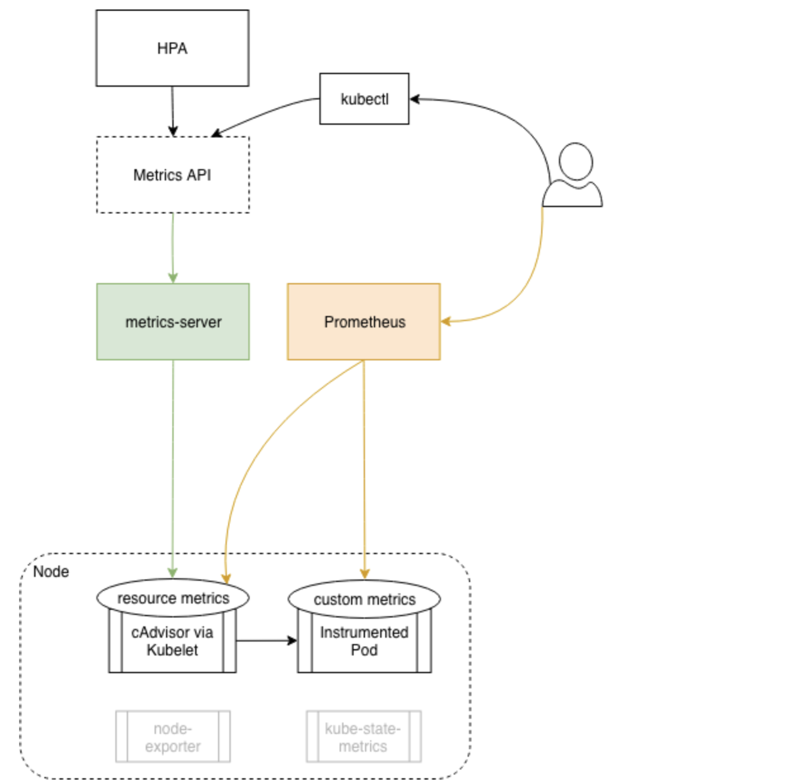

# roche-eks-july172024

### generating pod manifest 

```
kubectl   run  ashupodweb --image=docker.io/dockerashu/ashuroche:nginxappv1 --port 80 --dry-run=client -o yaml  >day2pod.yaml 
```

### creating pod 

```
ashu@roche-client k8s-resources]$ kubectl  create -f day2pod.yaml 
pod/ashupodweb created
[ashu@roche-client k8s-resources]$ kubectl   get pods
NAME           READY   STATUS              RESTARTS   AGE
ashupodweb     1/1     Running             0          5s
kudduspodweb   0/1     ContainerCreating   0          3s
[ashu@roche-client k8s-resources]$ kubectl   get pods  ashupodweb  -o wide
NAME         READY   STATUS    RESTARTS   AGE   IP              NODE                             NOMINATED NODE   READINESS GATES
ashupodweb   1/1     Running   0          12s   192.168.47.51   ip-192-168-62-198.ec2.internal   <none>           <none>
[ashu@roche-client k8s-resources]$ 
```

### understnading using service as internal k8s lb 


### understanding loadbalancer service with cloud  controlled k8s 


### understandign service discovery with svc type and label


### to create service make sure pod is having label 

```
[ashu@roche-client k8s-resources]$ kubectl   get pods  ashupodweb  --show-labels
NAME         READY   STATUS    RESTARTS   AGE   LABELS
ashupodweb   1/1     Running   0          84m   run=ashupodweb
[ashu@roche-client k8s-resources]$ kubectl   get pods   --show-labels
NAME           READY   STATUS    RESTARTS   AGE   LABELS
amitpod1       1/1     Running   0          83m   run=amitpod1
amitvpodweb    1/1     Running   0          84m   run=amitvpodweb
anipodweb      1/1     Running   0          84m   run=anipodweb
ashupodweb     1/1     Running   0          85m   run=ashupodweb
dppodweb       1/1     Running   0          84m   run=dppodweb
gauripodweb    1/1     Running   0          84m   run=gauripodweb
inayatweb      1/1     Running   0          84m   run=inayatweb
kdpodweb       1/1     Running   0          84m   run=kdpodweb
kudduspodweb   1/1     Running   0          84m   run=kudduspodweb
mg-nginx       1/1     Running   0          83m   run=mg-nginx
rajeshpodweb   1/1     Running   0          82m   run=rajeshpodweb
rajpodweb      1/1     Running   0          81m   run=rajpodweb
riyapodweb     1/1     Running   0          82m   run=riyapodweb
sanpodweb      1/1     Running   0          82m   run=sanpodweb
shobhitweb     1/1     Running   0          82m   run=shobhitweb
[ashu@roche-client k8s-resources]$ 

```

### we can change label in a running pod also 

```
[ashu@roche-client k8s-resources]$ kubectl  apply -f day2pod.yaml 
Warning: resource pods/ashupodweb is missing the kubectl.kubernetes.io/last-applied-configuration annotation which is required by kubectl apply. kubectl apply should only be used on resources created declaratively by either kubectl create --save-config or kubectl apply. The missing annotation will be patched automatically.
pod/ashupodweb configured
[ashu@roche-client k8s-resources]$ 
[ashu@roche-client k8s-resources]$ kubectl   get pods  ashupodweb  --show-labels
NAME         READY   STATUS    RESTARTS   AGE   LABELS
ashupodweb   1/1     Running   0          87m   run=ashupodweb,x1=helloashu
[ashu@roche-client k8s-resources]$ 

```
### creating service manifest 

```
[ashu@roche-client k8s-resources]$ kubectl   create  service
Create a service using a specified subcommand.

Aliases:
service, svc

Available Commands:
  clusterip      Create a ClusterIP service
  externalname   Create an ExternalName service
  loadbalancer   Create a LoadBalancer service
  nodeport       Create a NodePort service

Usage:
  kubectl create service [flags] [options]

Use "kubectl create service <command> --help" for more information about a given command.
Use "kubectl options" for a list of global command-line options (applies to all commands).


[ashu@roche-client k8s-resources]$ kubectl   create  service  loadbalancer  ashulb1   --tcp  80:80  --dry-run=client -o yaml
apiVersion: v1
kind: Service
metadata:
  creationTimestamp: null
  labels:
    app: ashulb1
  name: ashulb1
```

### checking service status

```
ashu@roche-client k8s-resources]$ kubectl   create  -f ashuinternal_lb.yaml 
service/ashulb1 created
[ashu@roche-client k8s-resources]$ kubectl   get  service 
NAME         TYPE           CLUSTER-IP      EXTERNAL-IP                                                              PORT(S)        AGE
amitlb1      LoadBalancer   10.100.136.63   <pending>                                                                80:31042/TCP   1s
ashulb1      LoadBalancer   10.100.50.192   a896c5766f97b4601b98ff7bce4dab2f-449321438.us-east-1.elb.amazonaws.com   80:31446/TCP   10s
kubernetes   ClusterIP      10.100.0.1      <none>                                    
                               443/TCP        3h57m


[ashu@roche-client k8s-resources]$ 
[ashu@roche-client k8s-resources]$ kubectl   get  endpoints  ashulb1  
NAME      ENDPOINTS   AGE
ashulb1   <none>      2m13s
[ashu@roche-client k8s-resources]$ 

```

### updating svc selector 

```
kubectl  replace  -f  ashuinternal_lb.yaml 
service/ashulb1 replaced
[ashu@roche-client k8s-resources]$ kubectl   get  service ashulb1 -o wide
NAME      TYPE           CLUSTER-IP      EXTERNAL-IP                                                              PORT(S)        AGE    SELECTOR
ashulb1   LoadBalancer   10.100.50.192   a896c5766f97b4601b98ff7bce4dab2f-449321438.us-east-1.elb.amazonaws.com   80:31446/TCP   6m7s   run=ashupodweb,x1=helloashu
[ashu@roche-client k8s-resources]$ kubectl   get  endpoints  ashulb1  
NAME      ENDPOINTS          AGE
ashulb1   192.168.47.51:80   6m12s
[ashu@roche-client k8s-resources]$ 

[ashu@roche-client k8s-resources]$ kubectl   get  pods ashupodweb -o wide
NAME         READY   STATUS    RESTARTS   AGE    IP              NODE                             NOMINATED NODE   READINESS GATES
ashupodweb   1/1     Running   0          105m   192.168.47.51   ip-192-168-62-198.ec2.internal   <none>           <none>
[ashu@roche-client k8s-resources]$ 


```

### understanding k8s controller 


### checking api resources in k8s 

```
humanfirmware@darwin  ~/Desktop/Tranings  kubectl   api-resources 
NAME                              SHORTNAMES   APIVERSION                        NAMESPACED   KIND
bindings                                       v1                                true         Binding
componentstatuses                 cs           v1                                false        ComponentStatus
configmaps                        cm           v1                                true         ConfigMap
endpoints                         ep           v1                                true         Endpoints
events                            ev           v1                                true         Event
limitranges                       limits       v1                                true         LimitRange
namespaces                        ns           v1                                false        Namespace
nodes                             no           v1                                false        Node
persistentvolumeclaims            pvc          v1                                true         PersistentVolumeClaim
persistentvolumes                 pv           v1                                false        PersistentVolume
pods                              po           v1                                true         Pod
podtemplates                                   v1                                true         PodTemplate
replicationcontrollers            rc           v1                                true         ReplicationController
resourcequotas                    quota        v1                                true         ResourceQuota
secrets                                        v1                                true         Secret
serviceaccounts                   sa           v1                                true         ServiceAccount
services                          svc          v1                                true         Service
mutatingwebhookconfigurations                  admissionregistration.k8s.io/v1   false        MutatingWebhookConfiguration
validatingwebhookconfigurations                admissionregistration.k8s.io/v1   false        ValidatingWebhookConfiguration
customresourcedefinitions         crd,crds     apiextensions.k8s.io/v1           false        CustomResourceDefinition
apiservices                                    apiregistration.k8s.io/v1         false        APIService
controllerrevisions                            apps/v1                           true         ControllerRevision
daemonsets                        ds           apps/v1                           true         DaemonSet
deployments                       deploy       apps/v1                           true         Deployment
replicasets                       rs           apps/v1                           true         ReplicaSet
statefulsets                      sts          apps/v1                           true         StatefulSet

```
### Creating deployment manifest 

```

[ashu@roche-client k8s-resources]$ kubectl   create  deployment  ashu-deploy  --image=docker.io/dockerashu/ashuroche:nginxappv1 --port 80 --dry-run=client  -o yaml   >deploy1.yaml 
```

### creating 

```
kubectl  create -f deploy1.yaml 
deployment.apps/ashu-deploy created
[ashu@roche-client k8s-resources]$ kubectl   get  deploy
NAME          READY   UP-TO-DATE   AVAILABLE   AGE
ashu-deploy   1/1     1            1           5s
dp-deploy     1/1     1            1           2m16s
mg-deploy     1/1     1            1           6s
[ashu@roche-client k8s-resources]$ kubectl   get  rs
NAME                      DESIRED   CURRENT   READY   AGE
ashu-deploy-56bbcb766d    1         1         1       18s
dp-deploy-66df65c6f       2         2         2       2m29s
kuddusdeploy-5bb478dcb8   1         1         1       6s
mg-deploy-6dd8cfd69c      1         1         1       19s
[ashu@roche-client k8s-resources]$ kubectl   get  pod
NAME                            READY   STATUS              RESTARTS   AGE
ashu-deploy-56bbcb766d-qcv5w    1/1     Running             0          23s
dp-deploy-66df65c6f-55phd       1/1     Running             0          2m34s
dp-deploy-66df65c6f-lvkmx       1/1     Running             0          11s
kuddusdeploy-5bb478dcb8-bhpjd   1/1     Running             0          11s
mg-deploy-6dd8cfd69c-bb7jp      1/1     Running             0          24s
rajesh-deploy-d894bf668-n7rrs   0/1     ContainerCreating   0          1s
```

### creating service using expose 

```
kubectl  expose  deployment  ashu-deploy   --type LoadBalancer --port 80 --name ashulb2  --dry-run=client -o yaml  >svc2.yaml 
```

### Understanding ingress controller 


### k8s thing


### deploy ingress controller in EKS 

```
kubectl  create  -f https://raw.githubusercontent.com/kubernetes/ingress-nginx/main/deploy/static/provider/aws/deploy.yaml
namespace/ingress-nginx created
serviceaccount/ingress-nginx created
serviceaccount/ingress-nginx-admission created
role.rbac.authorization.k8s.io/ingress-nginx created
role.rbac.authorization.k8s.io/ingress-nginx-admission created
clusterrole.rbac.authorization.k8s.io/ingress-nginx created
clusterrole.rbac.authorization.k8s.io/ingress-nginx-admission created
rolebinding.rbac.authorization.k8s.io/ingress-nginx created
rolebinding.rbac.authorization.k8s.io/ingress-nginx-admission created
clusterrolebinding.rbac.authorization.k8s.io/ingress-nginx created
clusterrolebinding.rbac.authorization.k8s.io/ingress-nginx-admission created
configmap/ingress-nginx-controller created
service/ingress-nginx-controller created
service/ingress-nginx-controller-admission created
deployment.apps/ingress-nginx-controller created
job.batch/ingress-nginx-admission-create created
job.batch/ingress-nginx-admission-patch created
ingressclass.networking.k8s.io/nginx created
validatingwebhookconfiguration.admissionregistration.k8s.io/ingress-nginx-admission created
```
### verify nginx ingress controller

```
kubectl   get  ns
NAME              STATUS   AGE
default           Active   3d2h
ingress-nginx     Active   89s
kube-node-lease   Active   3d2h
kube-public       Active   3d2h
kube-system       Active   3d2h
monitoring        Active   3d1h
[ashu@roche-client k8s-resources]$ kubectl   get  deploy -n  ingress-nginx
NAME                       READY   UP-TO-DATE   AVAILABLE   AGE
ingress-nginx-controller   1/1     1            1           99s
[ashu@roche-client k8s-resources]$ kubectl   get  pod -n  ingress-nginx
NAME                                       READY   STATUS      RESTARTS   AGE
ingress-nginx-admission-create-bcrb9       0/1     Completed   0          106s
ingress-nginx-admission-patch-z764j        0/1     Completed   2          106s
ingress-nginx-controller-f4d6b8f76-f8qr8   1/1     Running     0          107s
[ashu@roche-client k8s-resources]$ kubectl   get  svc  -n  ingress-nginx
NAME                                 TYPE           CLUSTER-IP       EXTERNAL-IP                                                                     PORT(S)                      AGE
ingress-nginx-controller             LoadBalancer   10.100.60.90     a64e2d60a40b04d868ed50fe24eda3b7-4ba65bad8a3641ca.elb.us-east-1.amazonaws.com   80:31520/TCP,443:31045/TCP   114s
ingress-nginx-controller-admission   ClusterIP      10.100.205.207   <none>                                                                          443/TCP                      114s
```

### creating and settting defautl namespace

```
kubectl   create  ns  ashu-app
namespace/ashu-app created
[ashu@roche-client k8s-resources]$ kubectl config set-context --current --namespace=ashu-app
Context "eks@delvex-cluster-new.us-east-1.eksctl.io" modified.
[ashu@roche-client k8s-resources]$ 
[ashu@roche-client k8s-resources]$ kubectl  get pods
No resources found in ashu-app namespace.
[ashu@roche-client k8s-resources]$ 

```

### checking default ns

```
kubectl config get-contexts
CURRENT   NAME                                         CLUSTER                                  AUTHINFO                                     NAMESPACE
*         eks@delvex-cluster-new.us-east-1.eksctl.io   delvex-cluster-new.us-east-1.eksctl.io   eks@delvex-cluster-new.us-east-1.eksctl.io   ashu-app
[ashu@roche-client k8s-resources]$ 


```

### deploy a common.yml file 

```
kubectl  create -f common.yaml 
deployment.apps/ashu-deploy created
service/ashulb2 created
[ashu@roche-client k8s-resources]$ kubectl  get  deploy
NAME          READY   UP-TO-DATE   AVAILABLE   AGE
ashu-deploy   1/1     1            1           15s
[ashu@roche-client k8s-resources]$ kubectl  get  pod
NAME                           READY   STATUS    RESTARTS   AGE
ashu-deploy-56bbcb766d-j8ddj   1/1     Running   0          21s
[ashu@roche-client k8s-resources]$ kubectl  get  svc
NAME      TYPE        CLUSTER-IP       EXTERNAL-IP   PORT(S)   AGE
ashulb2   ClusterIP   10.100.238.237   <none>        80/TCP    24s
[ashu@roche-client k8s-resources]$ kubectl  get  ep
NAME      ENDPOINTS         AGE
ashulb2   192.168.6.70:80   27s
```

## HPA in pods 


### a more detailed understanding 



### deploy metric server 

```
kubectl apply -f https://github.com/kubernetes-sigs/metrics-server/releases/latest/download/components.yaml
serviceaccount/metrics-server created
clusterrole.rbac.authorization.k8s.io/system:aggregated-metrics-reader created
clusterrole.rbac.authorization.k8s.io/system:metrics-server created
rolebinding.rbac.authorization.k8s.io/metrics-server-auth-reader created
clusterrolebinding.rbac.authorization.k8s.io/metrics-server:system:auth-delegator created
clusterrolebinding.rbac.authorization.k8s.io/system:metrics-server created
service/metrics-server created
deployment.apps/metrics-server created
apiservice.apiregistration.k8s.io/v1beta1.metrics.k8s.io created
 humanfirmware@darwin  ~/Desktop/Tranings  
 humanfirmware@darwin  ~/Desktop/Tranings  kubectl  get  po -n kube-system 
NAME                                       READY   STATUS        RESTARTS   AGE
aws-node-2xzc5                             2/2     Running       0          7h32m
aws-node-9vwhd                             2/2     Running       0          7h31m
aws-node-gb2qq                             2/2     Running       0          7h31m
aws-node-jt7gh                             2/2     Running       0          2d5h
aws-node-q7dl5                             2/2     Running       0          7h32m
aws-node-rkvxn                             2/2     Running       0          4h41m
calico-kube-controllers-6bdbc5dfcb-srgmw   0/1     Terminating   0          8h
coredns-54d6f577c6-lrp5k                   1/1     Running       0          2d23h
coredns-54d6f577c6-mr9r4                   1/1     Running       0          2d23h
kube-proxy-449cf                           1/1     Running       0          7h31m
kube-proxy-f6br4                           1/1     Running       0          7h31m
kube-proxy-m9qg5                           1/1     Running       0          2d5h
kube-proxy-nz7k7                           1/1     Running       0          7h32m
kube-proxy-nzdwq                           1/1     Running       0          7h32m
kube-proxy-pg5vl                           1/1     Running       0          4h41m
metrics-server-6d94bc8694-wdnx9            0/1     Running       0          26s

```

### verify metrics server 

```
 
[ashu@roche-client k8s-resources]$ kubectl  get  pods
NAME                           READY   STATUS    RESTARTS   AGE
ashu-deploy-56bbcb766d-shzbt   1/1     Running   0          18m
[ashu@roche-client k8s-resources]$ kubectl   top  pod ashu-deploy-56bbcb766d-shzbt 
NAME                           CPU(cores)   MEMORY(bytes)   
ashu-deploy-56bbcb766d-shzbt   0m           2Mi             
[ashu@roche-client k8s-resources]$ 
[ashu@roche-client k8s-resources]$ kubectl  get no
NAME                             STATUS   ROLES    AGE     VERSION
ip-192-168-114-19.ec2.internal   Ready    <none>   7h37m   v1.29.3-eks-ae9a62a
ip-192-168-26-51.ec2.internal    Ready    <none>   7h37m   v1.29.3-eks-ae9a62a
ip-192-168-39-122.ec2.internal   Ready    <none>   4h47m   v1.29.3-eks-ae9a62a
ip-192-168-62-198.ec2.internal   Ready    <none>   7h37m   v1.29.3-eks-ae9a62a
ip-192-168-77-87.ec2.internal    Ready    <none>   2d5h    v1.29.3-eks-ae9a62a
ip-192-168-80-84.ec2.internal    Ready    <none>   7h37m   v1.29.3-eks-ae9a62a
[ashu@roche-client k8s-resources]$ kubectl   top node ip-192-168-114-19.ec2.internal
NAME                             CPU(cores)   CPU%   MEMORY(bytes)   MEMORY%   
ip-192-168-114-19.ec2.internal   40m          2%     662Mi           19%       
[ashu@roche-client k8s-resources]$ kubectl  top 
Display resource (CPU/memory) usage.

 The top command allows you to see the resource consumption for nodes or pods.

 This command requires Metrics Server to be correctly configured and working on the server.

Available Commands:
  node          Display resource (CPU/memory) usage of nodes
  pod           Display resource (CPU/memory) usage of pods

Usage:
  kubectl top [flags] [options]

Use "kubectl top <command> --help" for more information about a given command.
Use "kubectl options" for a list of global command-line options (applies to all commands).
```

### hpa 

```
  230  kubectl   get  deploy
  231  kubectl   autoscale  deployment  ashu-deploy  --cpu-percent 70 --min=2 --max=10 --dry-run=client -o yaml 
  232  kubectl   autoscale  deployment  ashu-deploy  --cpu-percent 70 --min=2 --max=10 --dry-run=client -o yaml  >hpa.yml
  233  kubectl   create -f hpa.yml 
  234  kubectl   get  deploy
  235  history 
[ashu@roche-client k8s-resources]$ 
[ashu@roche-client k8s-resources]$ 
[ashu@roche-client k8s-resources]$ 
[ashu@roche-client k8s-resources]$ 
[ashu@roche-client k8s-resources]$ 
[ashu@roche-client k8s-resources]$ kubectl  get hpa
NAME          REFERENCE                TARGETS   MINPODS   MAXPODS   REPLICAS   AGE
ashu-deploy   Deployment/ashu-deploy   0%/70%    2         10        2          56s
[ashu@roche-client k8s-resources]$ 
```


