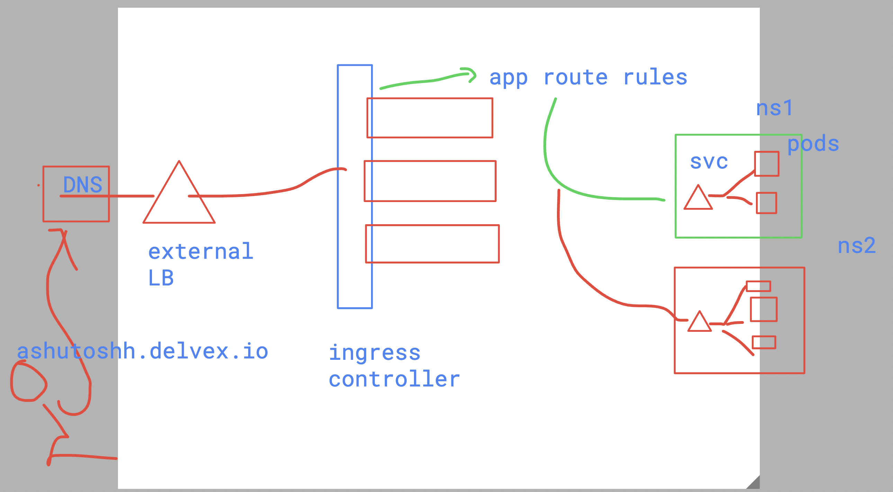
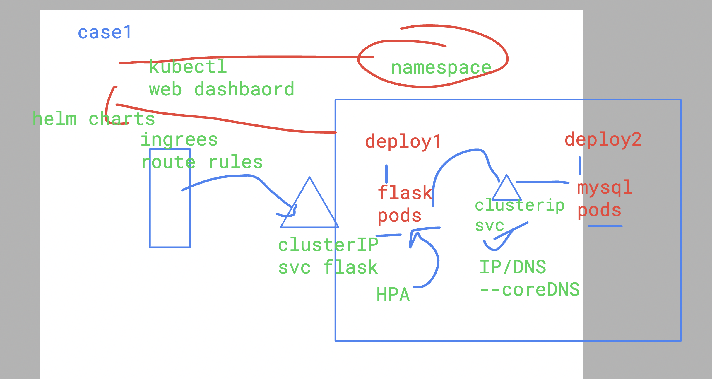
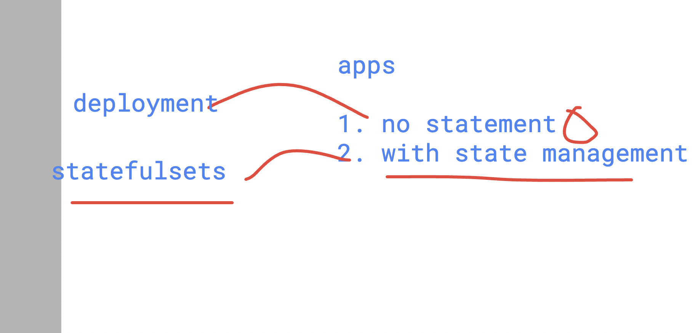
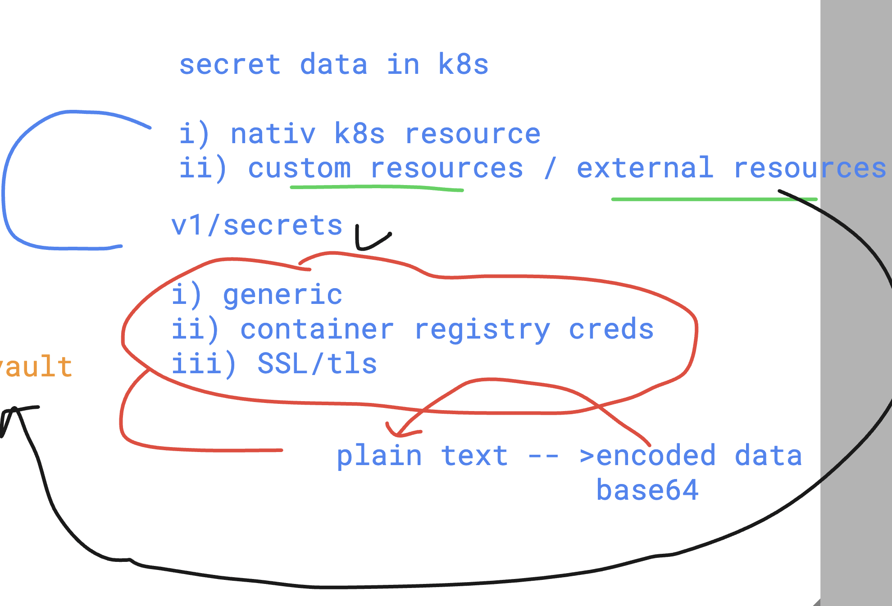
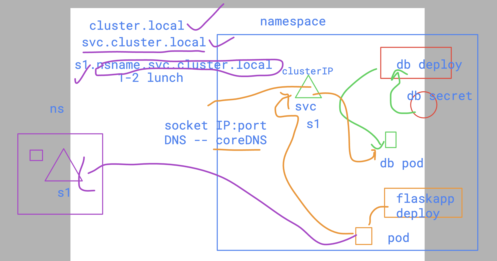
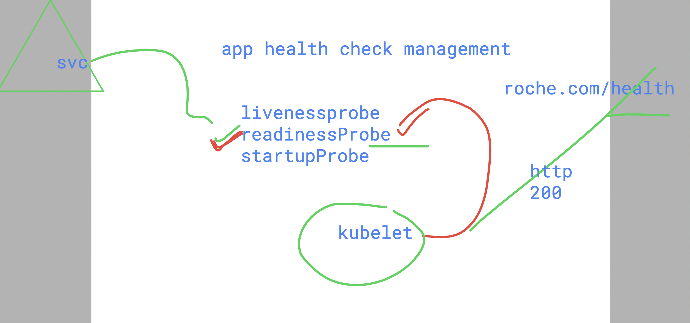
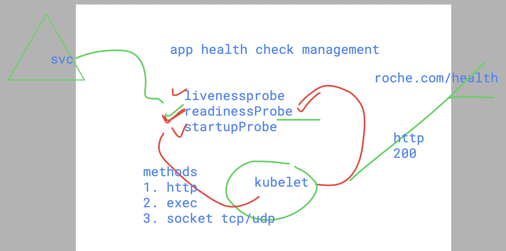
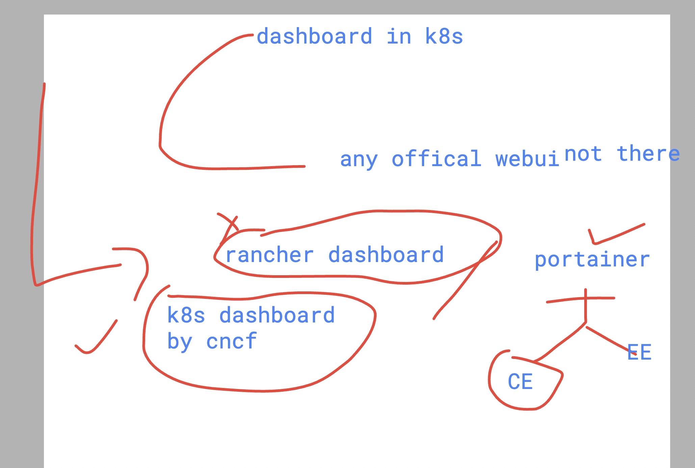

### k8s Revision 



### enable tab feature in kubectl 

```
[ashu@roche-client ashu-project]$ vim  ~/.bashrc   ^C
[ashu@roche-client ashu-project]$ 
[ashu@roche-client ashu-project]$ tail -2  ~/.bashrc 
unset rc
source <(kubectl completion bash)
[ashu@roche-client ashu-project]$ 
[ashu@roche-client ashu-project]$ source ~/.bashrc 
[ashu@roche-client ashu-project]$ 
[ashu@roche-client ashu-project]$ kubectl  get p
persistentvolumeclaims                                    policyendpoints.networking.k8s.aws
persistentvolumes                                         priorityclasses.scheduling.k8s.io
poddisruptionbudgets.policy                               prioritylevelconfigurations.flowcontrol.apiserver.k8s.io
podmonitors.monitoring.coreos.com                         probes.monitoring.coreos.com
pods                                                      prometheusagents.monitoring.coreos.com
pods.metrics.k8s.io                                       prometheuses.monitoring.coreos.com
podtemplates                                              prometheusrules.monitoring.coreos.com
[ashu@roche-client ashu-project]$ kubectl  get pod
No resources found in ashu-app namespace.
[ashu@roche-client ashu-project]$ kubectl config get-contexts 
CURRENT   NAME                                         CLUSTER                                  AUTHINFO                                     NAMESPACE
*         eks@delvex-cluster-new.us-east-1.eksctl.io   delvex-cluster-new.us-east-1.eksctl.io   eks@delvex-cluster-new.us-east-1.eksctl.io   ashu-app
[ashu@roche-client ashu-project]$ 

```

### Deploy two teir webapp



### flask directory structure 

```
tree  ashu-pythonfask/
ashu-pythonfask/
├── Dockerfile
├── app.py
├── compose.yaml
└── templates
    ├── index.html
    └── success.html

1 directory, 5 files
```

### pushing iamge to ECR 

```
[ashu@roche-client ashu-pythonfask]$ docker  images  | grep ashu
ashuflask                  appv1     435703f8778b   15 minutes ago   315MB
[ashu@roche-client ashu-pythonfask]$ 
[ashu@roche-client ashu-pythonfask]$ 
[ashu@roche-client ashu-pythonfask]$ 
[ashu@roche-client ashu-pythonfask]$ docker   tag   ashuflask:appv1   public.ecr.aws/h7s5d3t1/rocheflask:ashuappv1   
[ashu@roche-client ashu-pythonfask]$ 


====
aws ecr-public get-login-password --region us-east-1 | docker login --username AWS --password-stdin public.ecr.aws/h7s5d3t1
WARNING! Your password will be stored unencrypted in /home/ashu/.docker/config.json.
Configure a credential helper to remove this warning. See
https://docs.docker.com/engine/reference/commandline/login/#credentials-store

Login Succeeded
[ashu@roche-client ashu-pythonfask]$ docker push public.ecr.aws/h7s5d3t1/rocheflask:ashuappv1
The push refers to repository [public.ecr.aws/h7s5d3t1/rocheflask]
aee9de48b79b: Pushed 
7619ced1a792: Pushed 
9ce4f9c24974: Pushed 
8678a8b5654d: Layer already exists 
a58d16c447ed: Layer already exists 
b88d8bda5e53: Layer already exists 
8cddf1d30fbd: Layer already exists 
b9fc95825e61: Layer already exists 
32148f9f6c5a: Layer already exists 
ashuappv1: digest: sha256:01f404f7b642156221877ea2400dd68077ae3d72a74394ce2439eb28b74650ce size: 2203
[ashu@roche-client ashu-pythonfask]$ docker logout  public.ecr.aws
Removing login credentials for public.ecr.aws
[ashu@roche-client ashu-pythonfask]$ 

```

### deployment vs statefulsets



## Db deployemnt as single pod 

### creating deployment 

```
 kubectl   create  deployment  ashu-db --image=mysql:8.0 --port 3306  --dry-run=client -o yaml >db.yaml 
[ashu@roche-client ashu-pythonfask]$ 

```
### understanding secrets in k8s 



### creating secret

```
 kubectl  create secret 
Create a secret with specified type.

 A docker-registry type secret is for accessing a container registry.

 A generic type secret indicate an Opaque secret type.

 A tls type secret holds TLS certificate and its associated key.

Available Commands:
  docker-registry   Create a secret for use with a Docker registry
  generic           Create a secret from a local file, directory, or literal value
  tls               Create a TLS secret
```

### crewating 

```
kubectl  create secret   generic  ashudb-root-cred  --from-literal  ashurootKey="AshuExample@12345"  --dry-run=client -o yaml  >rootcred.yaml 
[ashu@roche-client ashu-pythonfask]$ 
[ashu@roche-client ashu-pythonfask]$ kubectl create -f rootcred.yaml 
secret/ashudb-root-cred created
[ashu@roche-client ashu-pythonfask]$ kubectl  get secrets
NAME               TYPE     DATA   AGE
ashudb-root-cred   Opaque   1      4s
[ashu@roche-client ashu-pythonfask]$ 

```

### 

```
ashu@roche-client ashu-pythonfask]$ kubectl  exec -it  ashu-db-8659dbd969-85s2m -- bash 
bash-5.1# 
bash-5.1# mysql -u root -pAshuExample@12345
mysql: [Warning] Using a password on the command line interface can be insecure.
Welcome to the MySQL monitor.  Commands end with ; or \g.
Your MySQL connection id is 8
Server version: 8.0.38 MySQL Community Server - GPL

Copyright (c) 2000, 2024, Oracle and/or its affiliates.

Oracle is a registered trademark of Oracle Corporation and/or its
affiliates. Other names may be trademarks of their respective
owners.

Type 'help;' or '\h' for help. Type '\c' to clear the current input statement.

mysql> show databases;
+--------------------+
| Database           |
+--------------------+
| ashudb             |
| information_schema |
| mysql              |
| performance_schema |
| sys                |
+--------------------+
5 rows in set (0.01 sec)

mysql> 

```

### creating service for db pod 

```
kubectl  get deploy
NAME      READY   UP-TO-DATE   AVAILABLE   AGE
ashu-db   1/1     1            1           16m
[ashu@roche-client ashu-pythonfask]$ kubectl expose deployment ashu-db --port 3306 --name ashudblb --dry-run=client -o yaml  >dbsvc.yaml 
[ashu@roche-client ashu-pythonfask]$ kubectl create -f dbsvc.yaml 
service/ashudblb created
[ashu@roche-client ashu-pythonfask]$ kubectl  get svc
NAME       TYPE        CLUSTER-IP       EXTERNAL-IP   PORT(S)    AGE
ashudblb   ClusterIP   10.100.188.188   <none>        3306/TCP   3s
[ashu@roche-client ashu-pythonfask]$ kubectl  get ep
NAME       ENDPOINTS            AGE
ashudblb   192.168.34.91:3306   7s
```
## flask webapp deploy 

### creating deployment 

```
kubectl create deployment  ashu-flaskapp --image=public.ecr.aws/h7s5d3t1/rocheflask:ashuappv1  --port 5000 --dry-run=client -o yaml >webapp.yaml 
```

### updating yaml 

```

```

## CoreDNS 



### creating configmap 

```
kubectl  create configmap  ashu-db-svc  --from-literal  dbconnect=ashudblb  --dry-run=client -o yaml  
apiVersion: v1
data:
  dbconnect: ashudblb
kind: ConfigMap
metadata:
  creationTimestamp: null
  name: ashu-db-svc
[ashu@roche-client ashu-pythonfask]$ kubectl  create configmap  ashu-db-svc  --from-literal  dbconnect=ashudblb  --dry-run=client -o yaml   >dbnamecm.yaml 
[ashu@roche-client ashu-pythonfask]$ kubectl  create  -f dbnamecm.yaml 
configmap/ashu-db-svc created
[ashu@roche-client ashu-pythonfask]$ 
[ashu@roche-client ashu-pythonfask]$ 
[ashu@roche-client ashu-pythonfask]$ kubectl  get  cm 
NAME               DATA   AGE
ashu-db-svc        1      5s
kube-root-ca.crt   1      23h
[ashu@roche-client ashu-pythonfask]$ 


```
### creating secret for flask connect

```
 kubectl  create secret generic  flask-db-cred  --from-literal MYSQL_USER=root --from-literal MYSQL_PASSWORD=AshuExample@12345  --dry-run=client -o yaml 
apiVersion: v1
data:
  MYSQL_PASSWORD: QXNodUV4YW1wbGVAMTIzNDU=
  MYSQL_USER: cm9vdA==
kind: Secret
metadata:
  creationTimestamp: null
  name: flask-db-cred
[ashu@roche-client ashu-pythonfask]$ kubectl  create secret generic  flask-db-cred  --from-literal MYSQL_USER=root --from-literal MYSQL_PASSWORD=AshuExample@12345  --dry-run=client -o yaml  >flask_db_secret.yaml 
[ashu@roche-client ashu-pythonfask]$ kubectl  create -f flask_db_secret.yaml 
secret/flask-db-cred created
[ashu@roche-client ashu-pythonfask]$ kubectl  get secrets 
NAME               TYPE     DATA   AGE
ashudb-root-cred   Opaque   1      132m
flask-db-cred      Opaque   2      6s
```

### final flask manifest

```
apiVersion: apps/v1
kind: Deployment
metadata:
  creationTimestamp: null
  labels:
    app: ashu-flaskapp
  name: ashu-flaskapp
spec:
  replicas: 1
  selector:
    matchLabels:
      app: ashu-flaskapp
  strategy: {}
  template:
    metadata:
      creationTimestamp: null
      labels:
        app: ashu-flaskapp
    spec:
      containers:
      - image: public.ecr.aws/h7s5d3t1/rocheflask:ashuappv1
        name: rocheflask
        ports:
        - containerPort: 5000
        envFrom:
        - secretRef:
            name: flask-db-cred
        env: 
        - name: MYSQL_HOST # targret db host ip / DNS name 
          #value: ashudblb.ashu-app.svc.cluster.local
          valueFrom: # calling value 
            configMapKeyRef: # from configmap 
              name: ashu-db-svc # name of cm
              key: dbconnect # key of cm 
        resources:
          limits:
            cpu: 100m
            memory: 150M 
status: {}

```

### 

```
[ashu@roche-client ashu-pythonfask]$ kubectl  create -f webapp.yaml 
deployment.apps/ashu-flaskapp created
[ashu@roche-client ashu-pythonfask]$ kubectl  get  deploy 
NAME            READY   UP-TO-DATE   AVAILABLE   AGE
ashu-db         1/1     1            1           137m
ashu-flaskapp   1/1     1            1           46s
[ashu@roche-client ashu-pythonfask]$ kubectl  get  pod
NAME                             READY   STATUS    RESTARTS   AGE
ashu-db-8659dbd969-85s2m         1/1     Running   0          137m
ashu-flaskapp-6c56c68b88-d9bfl   1/1     Running   0          50s
[ashu@roche-client ashu-pythonfask]$ kubectl  get  cm
NAME               DATA   AGE
ashu-db-svc        1      21m
kube-root-ca.crt   1      24h
[ashu@roche-client ashu-pythonfask]$ kubectl  get  secret
NAME               TYPE     DATA   AGE
ashudb-root-cred   Opaque   1      146m
flask-db-cred      Opaque   2      13m
[ashu@roche-client ashu-pythonfask]$ kubectl  get  svc
NAME       TYPE        CLUSTER-IP       EXTERNAL-IP   PORT(S)    AGE
ashudblb   ClusterIP   10.100.188.188   <none>        3306/TCP   120m
[ashu@roche-client ashu-pythonfask]$ 
```

### creating service 

```
kubectl  expose deployment ashu-flaskapp  --port 80 --target-port 5000 --name ashuflasklb --dry-run=client -o yaml  >flasksvc.yml 
[ashu@roche-client ashu-pythonfask]$ 
[ashu@roche-client ashu-pythonfask]$ 
[ashu@roche-client ashu-pythonfask]$ kubectl  create -f flasksvc.yml 
service/ashuflasklb created
[ashu@roche-client ashu-pythonfask]$ 
[ashu@roche-client ashu-pythonfask]$ kubectl get svc
NAME          TYPE        CLUSTER-IP       EXTERNAL-IP   PORT(S)    AGE
ashudblb      ClusterIP   10.100.188.188   <none>        3306/TCP   129m
ashuflasklb   ClusterIP   10.100.164.155   <none>        80/TCP     8s
[ashu@roche-client ashu-pythonfask]$ kubectl get ep
NAME          ENDPOINTS            AGE
ashudblb      192.168.34.91:3306   129m
ashuflasklb   192.168.10.42:5000   12s
[ashu@roche-client ashu-pythonfask]$ 

```

### final check 

```
kubectl  get  deploy
NAME            READY   UP-TO-DATE   AVAILABLE   AGE
ashu-db         1/1     1            1           155m
ashu-flaskapp   1/1     1            1           18m
[ashu@roche-client ashu-pythonfask]$ kubectl  get  secrets
NAME               TYPE     DATA   AGE
ashudb-root-cred   Opaque   1      163m
flask-db-cred      Opaque   2      31m
[ashu@roche-client ashu-pythonfask]$ kubectl  get  cm
NAME               DATA   AGE
ashu-db-svc        1      39m
kube-root-ca.crt   1      24h
[ashu@roche-client ashu-pythonfask]$ kubectl  get pod
NAME                             READY   STATUS    RESTARTS   AGE
ashu-db-8659dbd969-85s2m         1/1     Running   0          155m
ashu-flaskapp-6c56c68b88-d9bfl   1/1     Running   0          18m
[ashu@roche-client ashu-pythonfask]$ kubectl  get svc
NAME          TYPE        CLUSTER-IP       EXTERNAL-IP   PORT(S)    AGE
ashudblb      ClusterIP   10.100.188.188   <none>        3306/TCP   138m
ashuflasklb   ClusterIP   10.100.164.155   <none>        80/TCP     9m1s
[ashu@roche-client ashu-pythonfask]$ kubectl  get ing
NAME                           CLASS   HOSTS                 ADDRESS   PORTS   AGE
minimal-ingress-ashu-routing   nginx   ashutoshh.delvex.io             80      28s
[ashu@roche-client ashu-pythonfask]$ 

```

### ReadinessProbe in k8s -- handle by Kubelet 




### more info 



### dashboard in k8s 




