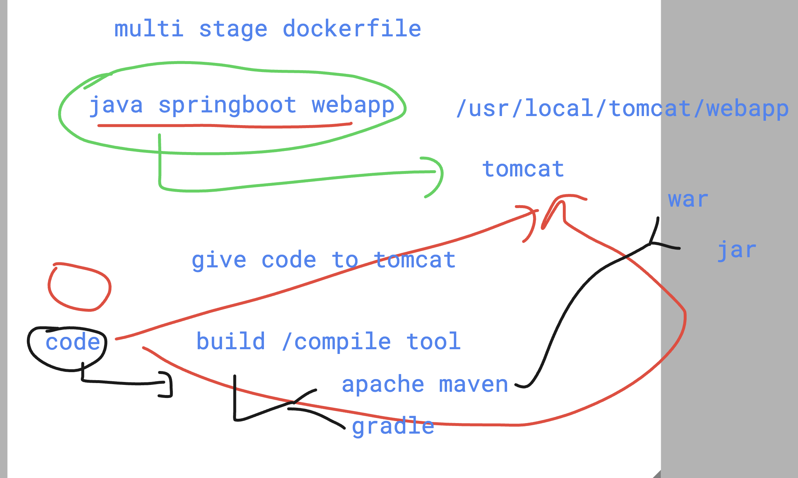
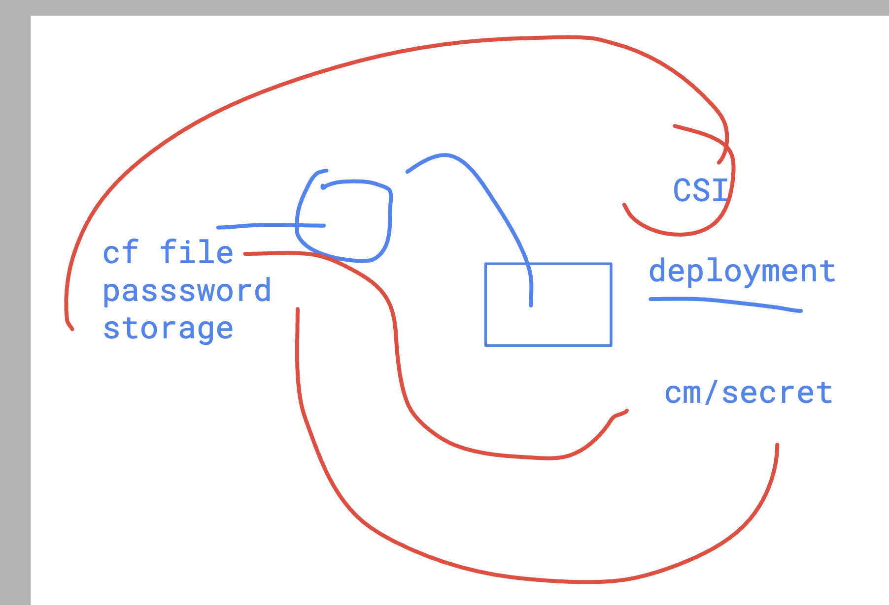
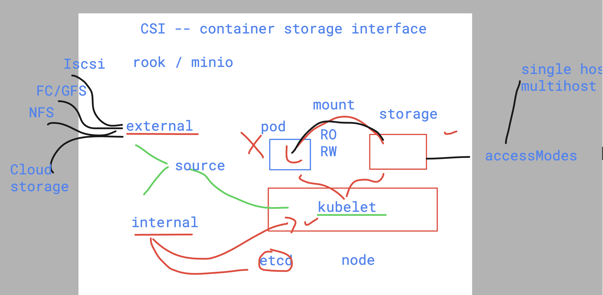
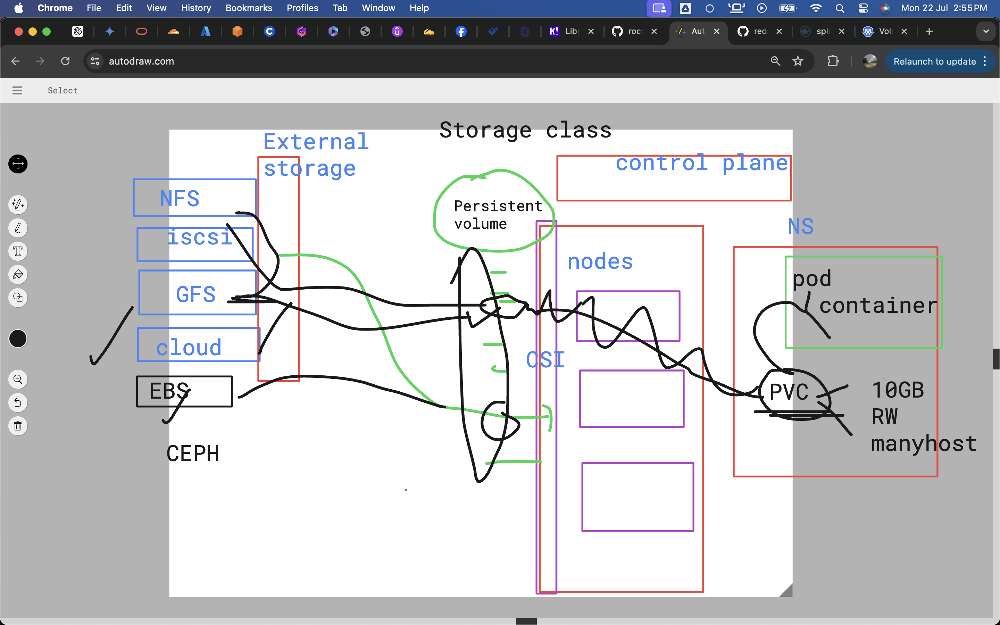

## building java spring webapp to war

```
[ashu@roche-client ashu-project]$ ls -a  java-springboot/
.  ..  .dockerignore  .git  Dockerfile  README.md  pom.xml  src
[ashu@roche-client ashu-project]$ docker build  -t  ashujavaweb:springv1  java-springboot/
[+] Building 119.7s (11/11) FINISHED                                                                              docker:default
 => [internal] load build definition from Dockerfile                                                                        0.0s
 => => transferring dockerfile: 342B                                                                                        0.0s
 => [internal] load metadata for docker.io/library/oraclelinux:8.4                                                          0.3s
 => [auth] library/oraclelinux:pull token for registry-1.docker.io                                                          0.0s
 => [internal] load .dockerignore                                                                                           0.0s
 => => transferring context: 139B                                                                                           0.0s
 => [1/5] FROM docker.io/library/oraclelinux:8.4@sha256:b81d5b0638bb67030b207d28586d0e714a811cc612396dbe3410db406998b3ad    6.5s
 => => resolve docker.io/library/oraclelinux:8.4@sha256:b81d5b0638bb67030b207d28586d0e714a811cc612396dbe3410db406998b3ad    0.0s
 => => sha256:a4df6f21af842935f0b80f5f255a88caf5f16b86e2642b468f83b8976666c3d7 90.36MB / 90.36MB                            1.8s
 => => sha256:b81d5b0638bb67030b207d28586d0e714a811cc612396dbe3410db406998b3ad 547B / 547B                                  0.0s
 => => sha256:ef0327c1a51e3471e9c2966b26b6245bd1f4c3f7c86d7edfb47a39adb446ceb5 529B / 529B                                  0.0s
 => => sha256:97e22ab49eea70a5d500e00980537605d56f30f9614b3a6d6c4ae9ddbd642489 1.48kB / 1.48kB                              0.0s
 => => extracting sha256:a4df6f21af842935f0b80f5f255a88caf5f16b86e2642b468f83b8976666c3d7                                   4.4s
 => [internal] load build context                                                                                           0.0s
 => => transferring context: 6.17kB                                                                                         0.0s
 => [2/5] RUN dnf install java-1.8.0-openjdk.x86_64  java-1.8.0-openjdk-devel.x86_64  maven  -y                            78.4s
 => [3/5] WORKDIR /ashu-java                                                                                                0.1s 
 => [4/5] COPY .  .                                                                                                         0.1s 
 => [5/5] RUN mvn clean package                                                                                            20.1s 
 => exporting to image                                                                                                     13.7s 
 => => exporting layers                                                                                                    13.7s 
 => => writing image sha256:f84bc7bb2913942af6d11ecc19afbad3f3e5406d82b7855d6e739c1ef8f06f3a                                0.0s 
 => => naming to docker.io/library/ashujavaweb:springv1                                                                     0.0s 
[ashu@roche-client ashu-project]$                            
```


### tomcat with maven 



### Cleaning namespace data

```
kubectl  delete all,secret,ing,cm --all 
secret "ashudb-root-cred" deleted
secret "flask-db-cred" deleted
ingress.networking.k8s.io "minimal-ingress-ashu-routing" deleted
configmap "ashu-db-svc" deleted
configmap "kube-root-ca.crt" deleted
configmap "seccomp-profile" deleted

```

### Understanding CSI 



### more info about storage 



## Deploykent of DB using secret and hostpath volume 

```
apiVersion: apps/v1
kind: Deployment
metadata:
  creationTimestamp: null
  labels:
    app: ashu-db
  name: ashu-db
spec:
  replicas: 1
  selector:
    matchLabels:
      app: ashu-db
  strategy: {}
  template:
    metadata:
      creationTimestamp: null
      labels:
        app: ashu-db
    spec:
      nodeName: ip-192-168-124-158.ec2.internal # static scheduling 
      volumes: # creating volume / storage
      - name: ashuvol1 
        hostPath: # storage gonna come from worker node where pod will be there
          path: /ashu/dbdata
          type: DirectoryOrCreate 
      containers:
      - image: mysql:8.0
        name: mysql
        ports:
        - containerPort: 3306
        env: # to supply env in container image
        - name: MYSQL_ROOT_PASSWORD
          valueFrom: 
            secretKeyRef:
              name: ashudb-root-cred
              key: ashurootKey
        - name: MYSQL_DATABASE
          value: ashudb # this database will be created 
        volumeMounts: # using volume inside container
        - name: ashuvol1 # using volume 
          mountPath: /var/lib/mysql/ 
        resources: 
          limits:
            memory: 800M
            cpu: 700m 
status: {}

```

### deploy 

```
[ashu@roche-client ashu-pythonfask]$ kubectl  create -f  rootcred.yaml  ^C
[ashu@roche-client ashu-pythonfask]$ 
[ashu@roche-client ashu-pythonfask]$ kubectl  create -f db.yaml  ^C
[ashu@roche-client ashu-pythonfask]$ 
[ashu@roche-client ashu-pythonfask]$ kubectl  get secrets
NAME               TYPE     DATA   AGE
ashudb-root-cred   Opaque   1      2m4s
[ashu@roche-client ashu-pythonfask]$ kubectl  get deploy
NAME      READY   UP-TO-DATE   AVAILABLE   AGE
ashu-db   1/1     1            1           79s
[ashu@roche-client ashu-pythonfask]$ kubectl  get po -o wide
NAME                       READY   STATUS    RESTARTS   AGE   IP                NODE                              NOMINATED NODE   READINESS GATES
ashu-db-6f69576898-dbhg7   1/1     Running   0          87s   192.168.101.246   ip-192-168-124-158.ec2.internal   <none>           <none>
[ashu@roche-client ashu-pythonfask]$ 


```

### access mysql db 

```
[ashu@roche-client ashu-pythonfask]$ kubectl  get secrets
NAME               TYPE     DATA   AGE
ashudb-root-cred   Opaque   1      3m45s
[ashu@roche-client ashu-pythonfask]$ kubectl  get secrets -o yaml 
apiVersion: v1
items:
- apiVersion: v1
  data:
    ashurootKey: QXNodUV4YW1wbGVAMTIzNDU=
  kind: Secret
  metadata:
    creationTimestamp: "2024-07-22T07:21:03Z"
    name: ashudb-root-cred
    namespace: ashu-app
    resourceVersion: "2049618"
    uid: 7702e207-42c6-4d4b-a46e-ca43891fe3b1
  type: Opaque
kind: List
metadata:
  resourceVersion: ""
[ashu@roche-client ashu-pythonfask]$ base64 -d 
QXNodUV4YW1wbGVAMTIzNDU=
AshuExample@12345[ashu@roche-client ashu-pythonfask]$ kubectl  get po 
NAME                       READY   STATUS    RESTARTS   AGE
ashu-db-6f69576898-dbhg7   1/1     Running   0          3m53s
[ashu@roche-client ashu-pythonfask]$ kubectl  exec -it ashu-db-6f69576898-dbhg7 -- bash  
bash-5.1# mysql -u root -pAshuExample@12345
mysql: [Warning] Using a password on the command line interface can be insecure.
Welcome to the MySQL monitor.  Commands end with ; or \g.
Your MySQL connection id is 8
Server version: 8.0.38 MySQL Community Server - GPL

Copyright (c) 2000, 2024, Oracle and/or its affiliates.

Oracle is a registered trademark of Oracle Corporation and/or its
affiliates. Other names may be trademarks of their respective
owners.

Type 'help;' or '\h' for help. Type '\c' to clear the current input statement.

mysql> 
```
### creating a database

```
[ashu@roche-client ashu-pythonfask]$ kubectl  get po 
NAME                       READY   STATUS    RESTARTS   AGE
ashu-db-6f69576898-dbhg7   1/1     Running   0          5m30s
[ashu@roche-client ashu-pythonfask]$ kubectl  exec -it ashu-db-6f69576898-dbhg7 -- bash  
bash-5.1# 
bash-5.1# mysql -u root -pAshuExample@12345
mysql: [Warning] Using a password on the command line interface can be insecure.
Welcome to the MySQL monitor.  Commands end with ; or \g.
Your MySQL connection id is 9
Server version: 8.0.38 MySQL Community Server - GPL

Copyright (c) 2000, 2024, Oracle and/or its affiliates.

Oracle is a registered trademark of Oracle Corporation and/or its
affiliates. Other names may be trademarks of their respective
owners.

Type 'help;' or '\h' for help. Type '\c' to clear the current input statement.

mysql> create database ashurochedb;
Query OK, 1 row affected (0.01 sec)

mysql> show databases;
+--------------------+
| Database           |
+--------------------+
| ashudb             |
| ashurochedb        |
| information_schema |
| mysql              |
| performance_schema |
| sys                |
+--------------------+
6 rows in set (0.01 sec)
```

### Creating PV and PVC 



## PV yaml

```
apiVersion: v1
kind: PersistentVolume
metadata:
  name: ashu-pv1 
spec:
  storageClassName: manual 
  capacity:
    storage: 10Gi # please use 1 to 10GB space 
  accessModes:
  - ReadWriteOnce 
  hostPath: # we can use EBS , EFS , nfs etc 
    path: /ashu/dbdatanew
    type: DirectoryOrCreate 
```

### creating it 

```
[ashu@roche-client ashu-pythonfask]$ kubectl  create -f ashu-pv.yaml 
persistentvolume/ashu-pv1 created
[ashu@roche-client ashu-pythonfask]$ kubectl   get  pv
NAME       CAPACITY   ACCESS MODES   RECLAIM POLICY   STATUS      CLAIM   STORAGECLASS   VOLUMEATTRIBUTESCLASS   REASON   AGE
ashu-pv1   10Gi       RWO            Retain           Available           manual         <unset>                          5s
[ashu@roche-client ashu-pythonfask]$ 


```

## Understanding Helm 


### adding repo to client machine 

```
[ashu@roche-client ashu-project]$ helm repo add ashu-bitnami   https://charts.bitnami.com/bitnami
"ashu-bitnami" has been added to your repositories
[ashu@roche-client ashu-project]$ 
[ashu@roche-client ashu-project]$ 
[ashu@roche-client ashu-project]$ helm repo ls
NAME            URL                               
ashu-bitnami    https://charts.bitnami.com/bitnami
[ashu@roche-client ashu-project]$ 


```

### searching it 

```
[ashu@roche-client ashu-project]$ helm search repo  nginx 

NAME                                    CHART VERSION   APP VERSION     DESCRIPTION                                       
ashu-bitnami/nginx                      18.1.5          1.27.0          NGINX Open Source is a web server that can be a...
ashu-bitnami/nginx-ingress-controller   11.3.15         1.11.1          NGINX Ingress Controller is an Ingress controll...
ashu-bitnami/nginx-intel                2.1.15          0.4.9           DEPRECATED NGINX Open Source for Intel is a lig...
[ashu@roche-client ashu-project]$ 
[ashu@roche-client ashu-project]$ 

```

### deploy chart

```
 helm install  ashu-webapp   ashu-bitnami/nginx   
NAME: ashu-webapp
LAST DEPLOYED: Mon Jul 22 10:26:32 2024
NAMESPACE: ashu-app
STATUS: deployed
REVISION: 1
TEST SUITE: None
```


### pulling chart

```
 helm search repo nginx 
NAME                                    CHART VERSION   APP VERSION     DESCRIPTION                                       
ashu-bitnami/nginx                      18.1.5          1.27.0          NGINX Open Source is a web server that can be a...
ashu-bitnami/nginx-ingress-controller   11.3.15         1.11.1          NGINX Ingress Controller is an Ingress controll...
ashu-bitnami/nginx-intel                2.1.15          0.4.9           DEPRECATED NGINX Open Source for Intel is a lig...
[ashu@roche-client ashu-project]$ 
[ashu@roche-client ashu-project]$ 
[ashu@roche-client ashu-project]$ helm  pull  ashu-bitnami/nginx   
[ashu@roche-client ashu-project]$ ls
ashu-pythonfask  config  html-sample-app  java-springboot  javaapp  k8s-resources  mytasks  nginx-18.1.5.tgz  pythonapp  web.yml  webapp
[ashu@roche-client ashu-project]$ 


```

### decompression chart

```
ls
ashu-pythonfask  config  html-sample-app  java-springboot  javaapp  k8s-resources  mytasks  nginx-18.1.5.tgz  pythonapp  web.yml  webapp
[ashu@roche-client ashu-project]$ tar xvzf  nginx-18.1.5.tgz 
nginx/Chart.yaml
nginx/Chart.lock
nginx/values.yaml
nginx/values.schema.json
nginx/templates/NOTES.txt
nginx/templates/_helpers.tpl
```
### updating 

```
548   helm install  ashu-webapp   ashu-bitnami/nginx    --values values.yaml 
  549  
  550  helm ls
  551  kubectl  get  svc
  552  history 
  553  helm uninstall ashu-webapp
  554  history 
  555  helm install  ashu-webapp   ashu-bitnami/nginx  --set service.type=ClusterIP
  556  history 
[ashu@roche-client ashu-project]$ 
[ashu@roche-client ashu-project]$ 
[ashu@roche-client ashu-project]$ 
[ashu@roche-client ashu-project]$ 
[ashu@roche-client ashu-project]$ 
[ashu@roche-client ashu-project]$ 
[ashu@roche-client ashu-project]$ 
[ashu@roche-client ashu-project]$ 
[ashu@roche-client ashu-project]$ 
[ashu@roche-client ashu-project]$ 
[ashu@roche-client ashu-project]$ kubectl  get svc
NAME                TYPE        CLUSTER-IP       EXTERNAL-IP   PORT(S)          AGE
ashu-webapp-nginx   ClusterIP   10.100.222.172   <none>        80/TCP,443/TCP   33s
[ashu@roche-client ashu-project]$ 
[ashu@roche-client ashu-project]$ 
[ashu@roche-client ashu-project]$ 
[ashu@roche-client ashu-project]$  helm uninstall ashu-webapp
release "ashu-webapp" uninstalled

```

## Creating dashbaord toekn 

```
kubectl  get  deploy -n kubernetes-dashboard 
NAME                        READY   UP-TO-DATE   AVAILABLE   AGE
dashboard-metrics-scraper   1/1     1            1           2d23h
kubernetes-dashboard        1/1     1            1           2d23h
 humanfirmware@darwin  ~/Desktop  kubectl  get  sa   -n kubernetes-dashboard
NAME                   SECRETS   AGE
default                0         2d23h
kubernetes-dashboard   0         2d23h
 humanfirmware@darwin  ~/Desktop  kubectl  create token kubernetes-dashboard  -n  kubernetes-dashboard 
eyJhbGciOiJSUzI1NiIsImtpZCI6ImFmNGU0ZGY3ZTVhMzljNWU2NWYyZmUzZjllZjAzOTAxMGYzODI5MjIifQ.eyJhdWQiOlsiaHR0cHM6Ly9rdWJlcm5ldGVzLmRlZmF1bHQuc3ZjIl0sImV4cCI6MTcyMTY1MDkxMCwiaWF0IjoxNzIxNjQ3MzEwLCJpc3MiOiJodHRwczovL29pZGMuZWtzLnVzLWVhc3QtMS5hbWF6b25hd3MuY29tL2lkL0Q2RUEwNzI3QzNBNkI5MUI0Qzc3MTkzNUJDQkZFRTA2Iiwia3ViZXJuZXRlcy5pbyI6eyJuYW1lc3BhY2UiOiJrdWJlcm5ldGVzLWRhc2hib2F
```

## Creating helm chart 

```
helm  create  ashu-flask-webapp
Creating ashu-flask-webapp
[ashu@roche-client ashu-project]$ 
[ashu@roche-client ashu-project]$ tree  ashu-flask-webapp/
ashu-flask-webapp/
├── Chart.yaml
├── charts
├── templates
│   ├── NOTES.txt
│   ├── _helpers.tpl
│   ├── deployment.yaml
│   ├── hpa.yaml
│   ├── ingress.yaml
│   ├── service.yaml
│   ├── serviceaccount.yaml
│   └── tests
│       └── test-connection.yaml
└── values.yaml

3 directories, 10 files
```

### values.yaml

```

```

### deploy 

```

[ashu@roche-client ashu-project]$ helm install ashu-webapppp  ./ashu-flask-webapp/
NAME: ashu-webapppp
LAST DEPLOYED: Mon Jul 22 11:43:02 2024
NAMESPACE: ashu-app
STATUS: deployed
REVISION: 1
NOTES:
1. Get the application URL by running these commands:
  export POD_NAME=$(kubectl get pods --namespace ashu-app -l "app.kubernetes.io/name=ashu-flask-webapp,app.kubernetes.io/instance=ashu-webapppp" -o jsonpath="{.items[0].metadata.name}")
  export CONTAINER_PORT=$(kubectl get pod --namespace ashu-app $POD_NAME -o jsonpath="{.spec.containers[0].ports[0].containerPort}")
  echo "Visit http://127.0.0.1:8080 to use your application"
  kubectl --namespace ashu-app port-forward $POD_NAME 8080:$CONTAINER_PORT
[ashu@roche-client ashu-project]$ 

```


