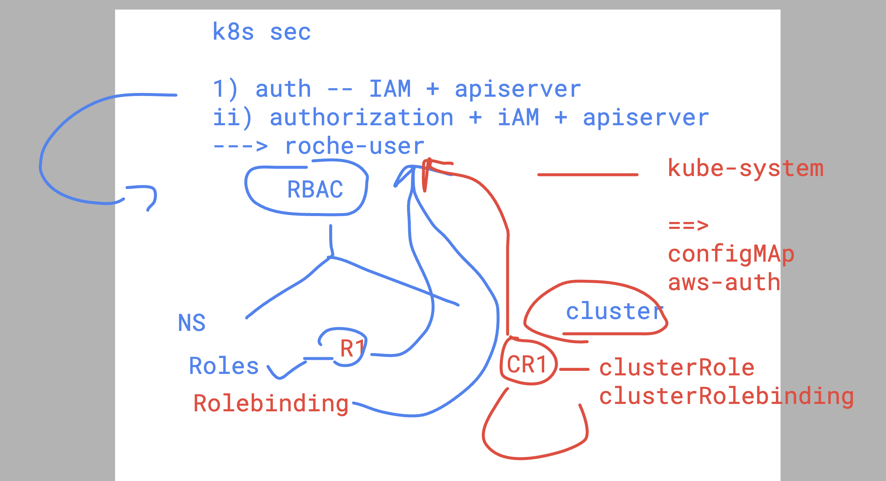

# Intro to container security 


## kubearmor github profile 

[click_here](https://github.com/kubearmor/KubeArmor)

### creating pod and  checking ops

```
[ashu@roche-client kubearmor-test]$ kubectl  run ashupod1 --image=nginx --port 80 
pod/ashupod1 created
[ashu@roche-client kubearmor-test]$ kubectl  get po 
NAME       READY   STATUS    RESTARTS   AGE
ashupod1   1/1     Running   0          6s
[ashu@roche-client kubearmor-test]$ kubectl  exec -it  ashupod1 -- bash 
root@ashupod1:/# cd /usr/share/nginx/html/
root@ashupod1:/usr/share/nginx/html# ls
50x.html  index.html
root@ashupod1:/usr/share/nginx/html# rm index.html 
root@ashupod1:/usr/share/nginx/html# ls
50x.html
root@ashupod1:/usr/share/nginx/html# apt udpate
E: Invalid operation udpate
root@ashupod1:/usr/share/nginx/html# apt update
Get:1 http://deb.debian.org/debian bookworm InRelease [151 kB]
Get:2 http://deb.debian.org/debian bookworm-updates InRelease [55.4 kB]
Get:3 http://deb.debian.org/debian-security bookworm-security InRelease [48.0 kB]
Get:4 http://deb.debian.org/debian bookworm/main amd64 Packages [8788 kB]
Get:5 http://deb.debian.org/debian bookworm-updates/main amd64 Packages [13.8 kB]
Get:6 http://deb.debian.org/debian-security bookworm-security/main amd64 Packages [169 kB]
Fetched 9225 kB in 1s (6632 kB/s)                         
Reading package lists... Done
Building dependency tree... Done
Reading state information... Done
4 packages can be upgraded. Run 'apt list --upgradable' to see them.
root@ashupod1:/usr/share/nginx/html# 
```

### policy yaml

```
apiVersion: security.kubearmor.com/v1
kind: KubeArmorPolicy
metadata:
  name: ashu-pod-armor-policy
spec:
  selector:
    matchLabels: # matching label of pod here
      run: ashupod1 
  process:
    matchPaths:
    - path: /usr/bin/apt
    - path: /usr/bin/apt-get
  action:
    Block
```

### apply 

```
kubectl create -f kubearm.yaml 
kubearmorpolicy.security.kubearmor.com/ashu-pod-armor-policy created
[ashu@roche-client kubearmor-test]$ kubectl  get  KubeArmorPolicy
NAME                    AGE
ashu-pod-armor-policy   14s
[ashu@roche-client kubearmor-test]$ 

```
### pod has k8s token access by default 

```
[ashu@roche-client kubearmor-test]$ kubectl exec -it ashupod1 -- bash 
root@ashupod1:/# 
root@ashupod1:/# 
root@ashupod1:/# 
root@ashupod1:/# cd  /run/
root@ashupod1:/run# ls
lock  nginx.pid  secrets
root@ashupod1:/run# cd secrets/
root@ashupod1:/run/secrets# ls
kubernetes.io
root@ashupod1:/run/secrets# cd kubernetes.io/
root@ashupod1:/run/secrets/kubernetes.io# ls
serviceaccount
root@ashupod1:/run/secrets/kubernetes.io# cd serviceaccount/
root@ashupod1:/run/secrets/kubernetes.io/serviceaccount# ls
ca.crt  namespace  token
root@ashupod1:/run/secrets/kubernetes.io/serviceaccount# cat token 
eyJhbGciOiJSUzI1NiIsImtpZCI6ImFmNGU0ZGY3ZTVhMzljNWU2NWYyZmUzZjllZjAzOTAxMGYzODI5MjIifQ.eyJhdWQiOlsiaHR0cHM6Ly9rdWJlcm5ldGVzLmRlZmF1bHQuc3ZjIl0sImV4cCI6MTc1MzI1MjA1MywiaWF0IjoxNzIxNzE2MDUzLCJpc3MiOiJodHRwczovL29pZGMuZWtzLnVzLWVhc3QtMS5hbWF6b25hd3MuY29tL2lkL0Q2RUEwNzI3QzNBNkI5MUI0Qzc3MTkzNUJDQkZFRTA2Iiwia3ViZXJuZXRlcy5pbyI6eyJuYW1lc3BhY2UiOiJhc2h1LWFwcCIsInBvZCI6eyJuYW1lIjoiYXNodXBvZDEiLCJ1aWQiOiJkZGFhYjlmNC1kM2M2LTRmMGMtYTk1Yi1hNGMzOWRmZGUzMTgifSwic2VydmljZWFjY291bnQiOnsibmFtZSI6ImRlZmF1bHQiLCJ1aWQiOiJlMmEzZDQyYy1mZWI0LTQ0OGItOTk1Yi02ZGUwOWJlNjI4M2YifSwid2FybmFmdGVyIjoxNzIxNzE5NjYwfSwibmJmIjoxNzIxNzE2MDUzLCJzdWIiOiJzeXN0ZW06c2VydmljZWFjY291bnQ6YXNodS1hcHA6ZGVmYXVsdCJ9.nkYPnkRs6Tz65kqt99fB_JggHmg0nPwqFHGv6s-Larg_BvQvubIdTYagIw3khtrGN-VhjO5I3uQsckYBLrObZ7ViSrRABkzR_9Q0Z6Acgb1K81R6Wb4nALL_SclsZAHNCI-c6JkamW8-gBqlaweKTgCRuHBu0ySw3pnmYF-Y2JkGKj56bNa-q0g3lS_t4GVXULQyC-LCNIMuiFPUqyBEe3w1Ft4znzYbLVOLvgnKlltb-Zr7rONkJ3WpFwl8v2dXfxA8UA6uhZqJmkS2_gJDKZHtac51zMGBy59kQ3NzJr6OjWSzQ0ancHQmXRHKtvfieAqu_2g1unklqQAuB-OPrgroot@ashupod1:/run/secrets/kubernetes.io/serviceaccount# 
```

### k8s security 

## IAM 


### RBAC in EKS 




### clusterrolebinding

```
  kubectl  get serviceaccount -n kubernetes-dashboard
 5551  kubectl  get serviceaccount -
 5552  kubectl  get serviceaccount 
 5553  kubectl  create ns  okey
 5554  kubectl get sa -n okey
 5555  kubectl get secret -n okey
 5556  kubectl  get serviceaccount -n kubernetes-dashboard
 5557  kubectl  create token kubernetes-dashboard  -n kubernetes-dashboard 
 5558  kubectl  create token default  -n kubernetes-dashboard 
 5559  kubectl  create token kubernetes-dashboard  -n kubernetes-dashboard 
 5560  kubectl  get serviceaccount -n kubernetes-dashboard
 5561  kubectl  get clusterroles 
 5562  kubectl  get clusterroles   | grep -i admin 
 5563  kubectl   create clusterrolebinding  -h
 5564  kubectl create clusterrolebinding  ashu-dashobardbind   --clusterrole cluster-admin --serviceaccount=kubernetes-dashboard:default 
 5565  kubectl create clusterrolebinding  ashu-dashobardbind   --clusterrole cluster-admin --serviceaccount=kubernetes-dashboard:default  --dry-runc=client -o yaml 
 5566  kubectl create clusterrolebinding  ashu-dashobardbind   --clusterrole cluster-admin --serviceaccount=kubernetes-dashboard:default  --dry-run=client -o yaml 
 5567  kubectl create clusterrolebinding  ashu-dashobardbind   --clusterrole cluster-admin --serviceaccount=kubernetes-dashboard:default  --dry-run=client -o yaml >dashbaord_full-access.yaml 
 5568  kubectl create -f dashbaord_full-access.yaml
 5569  kubectl get clusterrolebindings | grep -i ashu
 5570  history
 5571  kubectl  create token default  -n kubernetes-dashboard 

```

### creating service account 

```
[ashu@roche-client kubearmor-test]$ ls
kubearm.yaml
[ashu@roche-client kubearmor-test]$ kubectl   create  serviceaccount ashu-sa --dry-run=client -o yaml 
apiVersion: v1
kind: ServiceAccount
metadata:
  creationTimestamp: null
  name: ashu-sa
[ashu@roche-client kubearmor-test]$ kubectl get sa
NAME      SECRETS   AGE
default   0         4d23h
[ashu@roche-client kubearmor-test]$ kubectl   create  serviceaccount ashu-sa --dry-run=client -o yaml  >sa1.yaml 
[ashu@roche-client kubearmor-test]$ kubectl create -f sa1.yaml 
serviceaccount/ashu-sa created
[ashu@roche-client kubearmor-test]$ kubectl  get sa
NAME      SECRETS   AGE
ashu-sa   0         21s
default   0         4d23h
[ashu@roche-client kubearmor-test]$ 
```

### creting pod read role 

```
[ashu@roche-client kubearmor-test]$ kubectl create  role  ashu-pod-readRole --verb=get --verb=list --verb=watch --resource=pods  --dry-run=client -o yaml 
apiVersion: rbac.authorization.k8s.io/v1
kind: Role
metadata:
  creationTimestamp: null
  name: ashu-pod-readRole
rules:
- apiGroups:
  - ""
  resources:
  - pods
  verbs:
  - get
  - list
  - watch
[ashu@roche-client kubearmor-test]$ kubectl create  role  ashu-pod-readRole --verb=get --verb=list --verb=watch --resource=pods  --dry-run=client -o yaml >pod_readRole.yaml 
[ashu@roche-client kubearmor-test]$ kubectl  create -f pod_readRole.yaml 
role.rbac.authorization.k8s.io/ashu-pod-readRole created
[ashu@roche-client kubearmor-test]$ kubectl  get roles
NAME                CREATED AT
ashu-pod-readRole   2024-07-23T09:08:47Z
[ashu@roche-client kubearmor-test]$ 


```

### Roles and ClusterRole


### binding clusterRole to svc account 

```
[ashu@roche-client kubearmor-test]$ kubectl  get  clusterrole  | grep -i ashu
ashu-cls-role                                                          2024-07-23T09:25:01Z
ashu-reader                                                            2024-07-23T01:14:28Z
[ashu@roche-client kubearmor-test]$ 
[ashu@roche-client kubearmor-test]$ kubectl  get  sa
NAME      SECRETS   AGE
ashu-sa   0         26m
default   0         5d
[ashu@roche-client kubearmor-test]$ kubectl create clusterrolebinding ashu-clsrole-bind1  --clusterrole ashu-cls-role --serviceaccount=ashu-app:ashu-sa   --dry-run=client -o yaml 
apiVersion: rbac.authorization.k8s.io/v1
kind: ClusterRoleBinding
metadata:
  creationTimestamp: null
  name: ashu-clsrole-bind1
roleRef:
  apiGroup: rbac.authorization.k8s.io
  kind: ClusterRole
  name: ashu-cls-role
subjects:
- kind: ServiceAccount
  name: ashu-sa
  namespace: ashu-app
[ashu@roche-client kubearmor-test]$ kubectl create clusterrolebinding ashu-clsrole-bind1  --clusterrole ashu-cls-role --serviceaccount=ashu-app:ashu-sa   --dry-run=client -o yaml >clsrolebind1.yaml 
[ashu@roche-client kubearmor-test]$ kubectl create -f clsrolebind1.yaml 
clusterrolebinding.rbac.authorization.k8s.io/ashu-clsrole-bind1 created
[ashu@roche-client kubearmor-test]$ 


```


